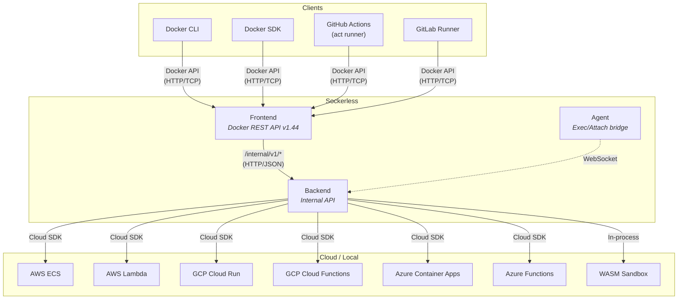
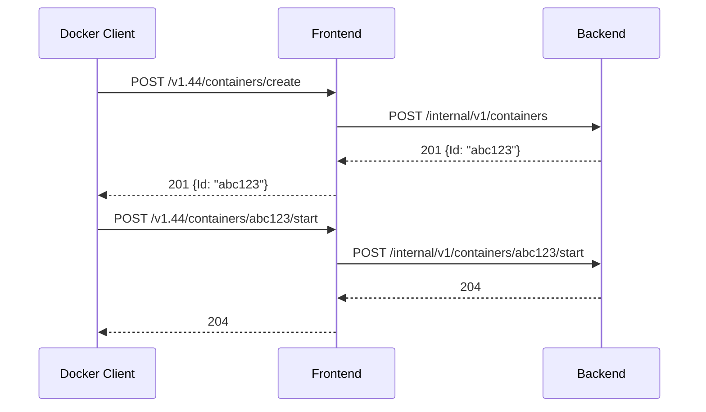
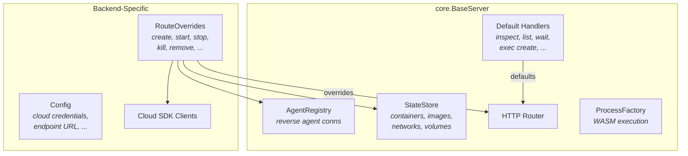
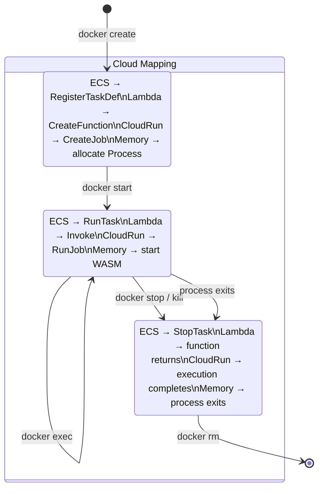
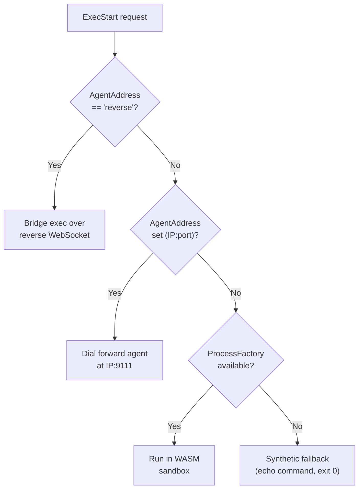
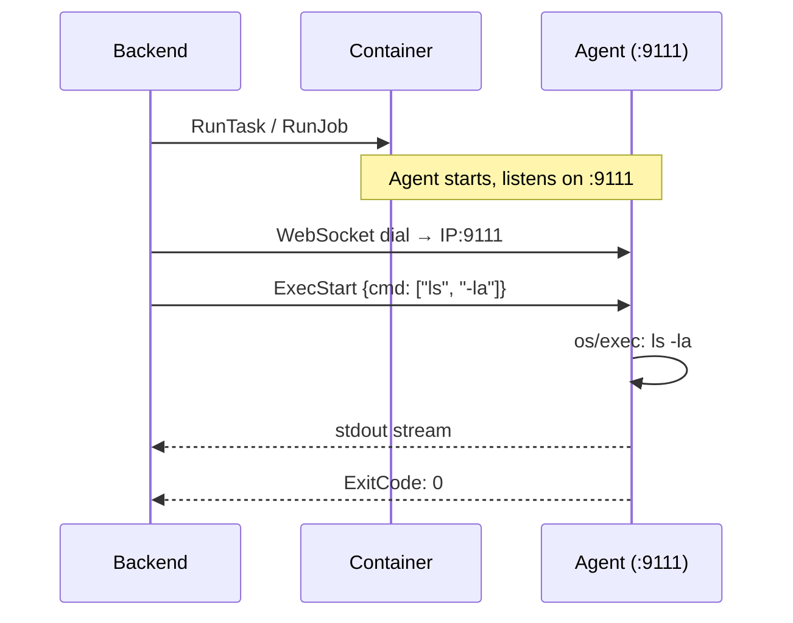
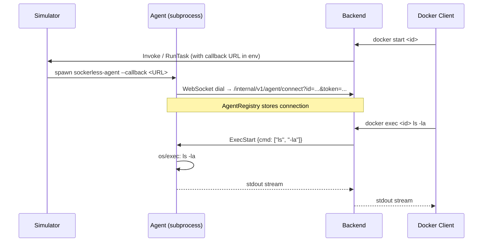
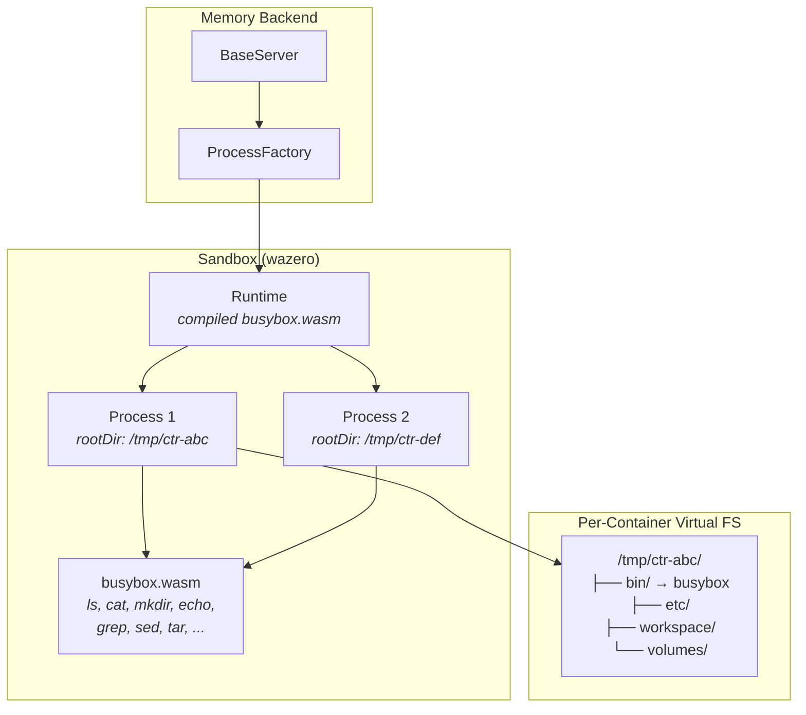
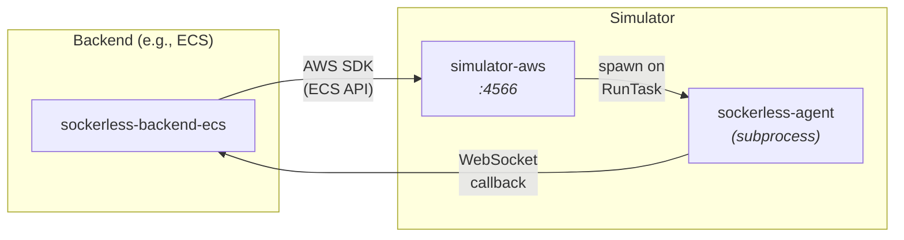
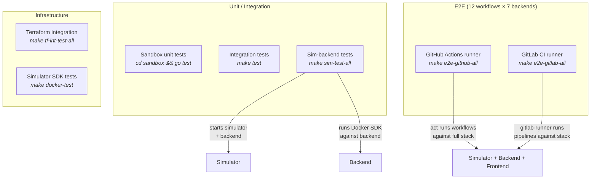

# Sockerless Architecture

Sockerless implements the Docker API without Docker. Any Docker client (CLI, SDK, CI runner) can connect to Sockerless and run containers backed by cloud services (AWS ECS, Lambda, GCP Cloud Run, Cloud Functions, Azure Container Apps, Azure Functions) or an in-process WASM sandbox.

## High-Level Overview



The system has three layers:

- **Frontend** — Stateless HTTP server implementing Docker REST API v1.44. Translates Docker protocol to internal API calls.
- **Backend** — Stateful server managing container lifecycle. Seven implementations share a common core.
- **Agent** — Binary injected into containers for exec/attach. Bridges commands between backend and the container's shell.

---

## Frontend

The Docker frontend (`frontends/docker/`) exposes the Docker API surface: containers, images, networks, volumes, exec, system. It strips the `/v1.XX/` version prefix and proxies every request to a backend over HTTP.



For streaming operations (exec, attach, logs), the frontend hijacks the HTTP connection and bridges bidirectional I/O between the Docker client and backend.

---

## Backends

All seven backends embed a shared `core.BaseServer` that provides HTTP routing, in-memory state (`Store`), agent registry, and default handlers. Each backend overrides specific handlers via `RouteOverrides` to implement cloud-specific logic.



### Backend Matrix

| Backend | Driver | Cloud Service | Agent Mode | Execution |
|---------|--------|--------------|------------|-----------|
| **memory** | memory | — | — | WASM sandbox (wazero) |
| **ecs** | ecs | ECS/Fargate | Forward or Reverse | Real container |
| **lambda** | lambda | Lambda | Reverse | Function invoke |
| **cloudrun** | cloudrun | Cloud Run Jobs | Forward or Reverse | Job execution |
| **gcf** | gcf | Cloud Run Functions | Reverse | Function invoke |
| **aca** | aca | Container Apps Jobs | Forward or Reverse | Job execution |
| **azf** | azf | Azure Functions | Reverse | Function invoke |

Container backends (ECS, CloudRun, ACA) use **forward agent** in production (backend dials agent inside container) and **reverse agent** in simulator mode (agent dials back to backend). FaaS backends (Lambda, GCF, AZF) always use reverse agent.

---

## Container Lifecycle

A container's lifecycle maps to cloud operations differently per backend, but the Docker API surface is identical.



### Container Create

Backend creates the container's cloud resource definition and stores metadata locally:

- **ECS**: Registers a task definition with the agent binary in the entrypoint
- **Lambda**: Creates a Lambda function with the container image
- **CloudRun**: Prepares a Job spec (protobuf)
- **ACA**: Prepares a Container Apps Job spec
- **Memory**: Allocates a WASM `Process` with a virtual filesystem

### Container Start

Backend launches the cloud resource and establishes an agent connection:

- **Container backends** (ECS/CloudRun/ACA): Call RunTask/RunJob/StartExecution, then wait for agent
- **FaaS backends** (Lambda/GCF/AZF): Call Invoke, agent dials back via callback URL
- **Memory**: Starts the main command in the WASM sandbox

### Container Exec

Exec is how commands run inside a started container. The routing has a fallback hierarchy:



1. **Reverse agent** — Agent has an active WebSocket to the backend. Exec is bridged over that connection.
2. **Forward agent** — Backend dials the agent inside the container at `<IP>:9111`.
3. **WASM process** — Memory backend runs the command in the sandbox.
4. **Synthetic** — Last resort. Echoes the command text and returns exit 0. Used when no real execution is available.

---

## The Agent

The agent (`agent/`) is a small binary injected into every container's entrypoint. It handles exec and attach by bridging commands between the backend and the container's shell over WebSocket.

### Forward Mode (Production)

The agent listens on `:9111` inside the container. The backend discovers the container's IP and dials in.



### Reverse Mode (Simulator / FaaS)

The agent dials *out* to the backend via a callback URL. No inbound connectivity needed.



### Entrypoint Wrapping

The backend wraps the user's command with the agent binary at container creation time:

```
# Forward mode (keep-alive, listens on :9111)
Original:  ["python", "app.py"]
Wrapped:   ["/sockerless/bin/sockerless-agent", "--addr", ":9111", "--keep-alive", "--", "python", "app.py"]

# Reverse mode (callback, dials backend)
Original:  ["python", "app.py"]
Wrapped:   ["/sockerless/bin/sockerless-agent", "--callback", "<url>", "--keep-alive", "--", "python", "app.py"]
```

The agent runs the original command as its main process and handles exec/attach requests concurrently.

---

## Memory Backend + WASM Sandbox

The memory backend runs containers entirely in-process using a WebAssembly sandbox. No cloud resources, no Docker daemon, no containers — just WASM.



Each container gets:
- A temp directory as its root filesystem, populated with an Alpine-like layout
- Volume mounts mapped to host directories
- A shell interpreter (`mvdan.cc/sh`) that executes commands using the compiled busybox WASM module
- Isolated stdout/stderr capture for logs and attach

The busybox WASM binary is built from `go-busybox` via TinyGo and embedded in the Go binary at compile time. It provides ~30 common Unix utilities (ls, cat, mkdir, cp, grep, sed, tar, etc.).

---

## Simulators

Simulators (`simulators/{aws,gcp,azure}/`) are standalone HTTP servers that implement subsets of cloud APIs. They allow backends to run against local fake infrastructure for testing.



Key points:
- Simulators are **decoupled** from backends. They don't import backend code.
- Backends talk to simulators via standard cloud SDKs pointed at `localhost` via `SOCKERLESS_ENDPOINT_URL`.
- When a simulator receives a task/function invoke and sees `SOCKERLESS_AGENT_CALLBACK_URL` in the environment, it spawns an agent subprocess that dials back to the backend.
- Each cloud has its own simulator on a dedicated port: AWS `:4566`, GCP `:4567`, Azure `:4568`.

### Simulator Coverage

| Simulator | APIs Implemented |
|-----------|-----------------|
| **AWS** | ECS (clusters, task defs, tasks), Lambda (functions, invoke), ECR (auth, manifests), CloudWatch Logs |
| **GCP** | Cloud Run Services, Cloud Run Jobs, Cloud Functions, Artifact Registry, Cloud Logging |
| **Azure** | Container Apps Environments/Jobs, Functions, App Service Plans, ACR, Storage (blob), Resource Groups |

---

## Module Structure

The project is organized as a Go workspace with 14+ modules:

```
sockerless/
├── api/                          # Shared types (zero deps)
├── frontends/
│   └── docker/                   # Docker REST API frontend
├── backends/
│   ├── core/                     # Shared backend library
│   ├── memory/                   # WASM sandbox backend
│   ├── ecs/                      # AWS ECS/Fargate
│   ├── lambda/                   # AWS Lambda
│   ├── cloudrun/                 # GCP Cloud Run Jobs
│   ├── cloudrun-functions/       # GCP Cloud Run Functions
│   ├── aca/                      # Azure Container Apps Jobs
│   └── azure-functions/          # Azure Functions
├── agent/                        # WebSocket agent binary
├── sandbox/                      # WASM runtime (wazero + busybox)
├── simulators/
│   ├── aws/                      # AWS API simulator
│   ├── gcp/                      # GCP API simulator
│   └── azure/                    # Azure API simulator
├── terraform/                    # IaC modules for real deployment
└── tests/                        # Integration + E2E tests
```

Each backend, simulator, and the sandbox are separate Go modules connected via `go.work`. Simulators are **not** in the workspace (built with `GOWORK=off`) to avoid dependency conflicts with cloud SDKs.

---

## Test Architecture



- **Sim-backend tests**: Start a simulator + backend pair, run 107 Docker SDK tests against them.
- **E2E tests**: Start the full stack (simulator + backend + frontend), run real CI workflows (GitHub Actions via `act`, GitLab CI via `gitlab-runner`) that exercise container create/start/exec/stop/remove.
- **Terraform integration tests**: Apply real Terraform modules against simulators to verify IaC compatibility.
