# Sockerless Architecture

Sockerless implements the Docker API without Docker. Any Docker client (CLI, SDK, CI runner) can connect to Sockerless and run containers backed by cloud services (AWS ECS, Lambda, GCP Cloud Run, Cloud Functions, Azure Container Apps, Azure Functions) or an in-process WASM sandbox.

The production goal: **replace Docker Engine with Sockerless and run containers on real cloud infrastructure.** Any program that talks to Docker — `docker run`, `docker compose`, CI runners (GitHub Actions, GitLab CI), test frameworks (TestContainers), or custom Docker SDK clients — works unchanged. Set `DOCKER_HOST` to point at Sockerless, and every container operation becomes a cloud API call to ECS, Lambda, Cloud Run, or whichever backend is configured.

## High-Level Overview

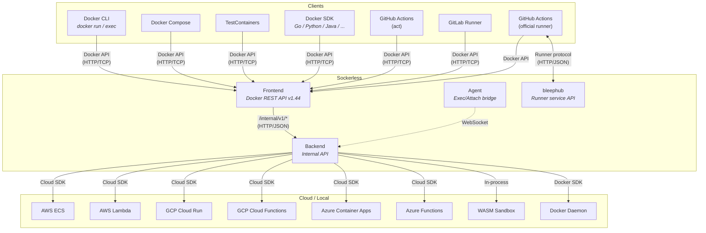

The system has four layers:

- **Frontend** — Stateless HTTP server implementing Docker REST API v1.44. Translates Docker protocol to internal API calls.
- **Backend** — Stateful server managing container lifecycle. Eight implementations share a common core.
- **Agent** — Binary injected into cloud containers for exec/attach. Bridges commands between backend and the container's shell.
- **bleephub** — GitHub Actions runner service API. Dispatches jobs to the official `actions/runner`, which executes them through the Docker frontend.

---

## Frontend

The Docker frontend (`frontends/docker/`) exposes the Docker API surface: containers, images, networks, volumes, exec, system. It strips the `/v1.XX/` version prefix and proxies every request to a backend over HTTP.

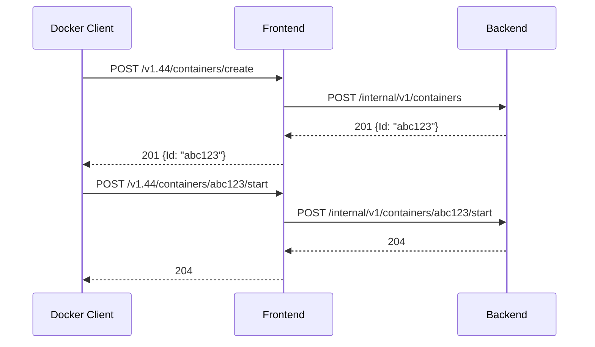

For streaming operations (exec, attach, logs), the frontend hijacks the HTTP connection and bridges bidirectional I/O between the Docker client and backend.

---

## Backends

All eight backends embed a shared `core.BaseServer` that provides HTTP routing, in-memory state (`Store`), agent registry, and default handlers. Each backend overrides specific handlers via `RouteOverrides` to implement cloud-specific logic.

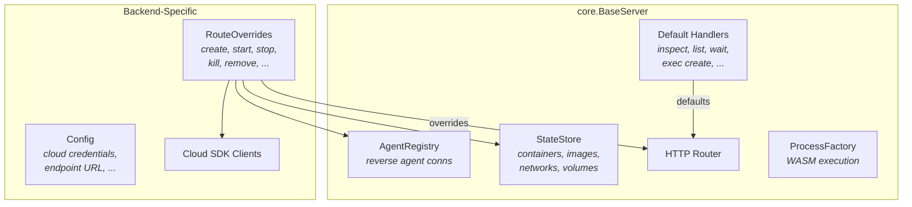

### Backend Matrix

| Backend | Cloud Service | Agent Mode | Execution |
|---------|--------------|------------|-----------|
| **memory** | — | — | WASM sandbox (wazero) |
| **docker** | — | — | Docker daemon passthrough |
| **ecs** | ECS/Fargate | Forward or Reverse | Real container |
| **lambda** | Lambda | Reverse | Function invoke |
| **cloudrun** | Cloud Run Jobs | Forward or Reverse | Job execution |
| **gcf** | Cloud Run Functions | Reverse | Function invoke |
| **aca** | Container Apps Jobs | Forward or Reverse | Job execution |
| **azf** | Azure Functions | Reverse | Function invoke |

**Local backends** (memory, docker) need no agent — memory runs commands in a WASM sandbox, docker proxies to a real Docker daemon.

**Container backends** (ECS, CloudRun, ACA) use **forward agent** in production (backend dials agent inside container) and **reverse agent** in simulator mode (agent dials back to backend).

**FaaS backends** (Lambda, GCF, AZF) always use **reverse agent** — inbound connections aren't possible, so the agent inside the function dials out to the backend via a callback URL.

---

## Container Lifecycle

A container's lifecycle maps to cloud operations differently per backend, but the Docker API surface is identical.

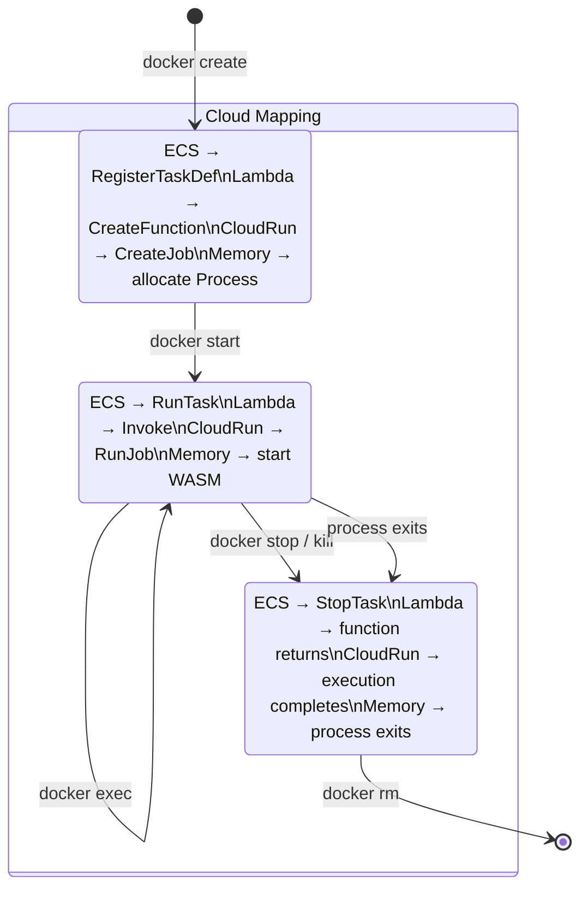

### Container Create

Backend creates the container's cloud resource definition and stores metadata locally:

- **ECS**: Registers a task definition with the agent binary in the entrypoint
- **Lambda**: Creates a Lambda function with the container image
- **CloudRun**: Prepares a Job spec (protobuf)
- **ACA**: Prepares a Container Apps Job spec
- **Memory**: Allocates a WASM `Process` with a virtual filesystem

### Container Start

Backend launches the cloud resource and establishes an agent connection:

- **Container backends** (ECS/CloudRun/ACA): Call RunTask/RunJob/StartExecution, then wait for agent
- **FaaS backends** (Lambda/GCF/AZF): Call Invoke, agent dials back via callback URL
- **Memory**: Starts the main command in the WASM sandbox

### Container Exec

Exec is how commands run inside a started container. The routing has a fallback hierarchy:

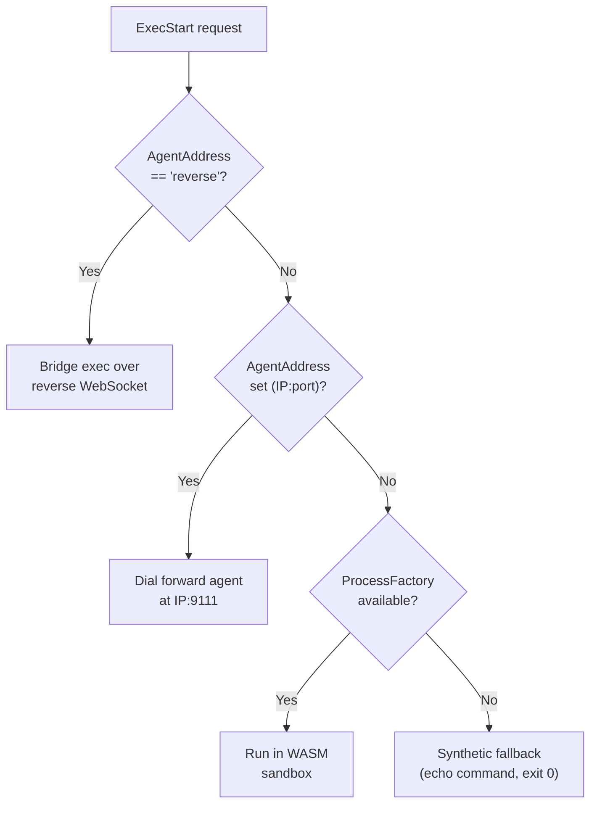

1. **Reverse agent** — Agent has an active WebSocket to the backend. Exec is bridged over that connection.
2. **Forward agent** — Backend dials the agent inside the container at `<IP>:9111`.
3. **WASM process** — Memory backend runs the command in the sandbox.
4. **Synthetic** — Last resort. Echoes the command text and returns exit 0. Used when no real execution is available.

---

## The Agent

The agent (`agent/`) is a small binary injected into every container's entrypoint. It handles exec and attach by bridging commands between the backend and the container's shell over WebSocket.

### Forward Mode (Production)

The agent listens on `:9111` inside the container. The backend discovers the container's IP and dials in.

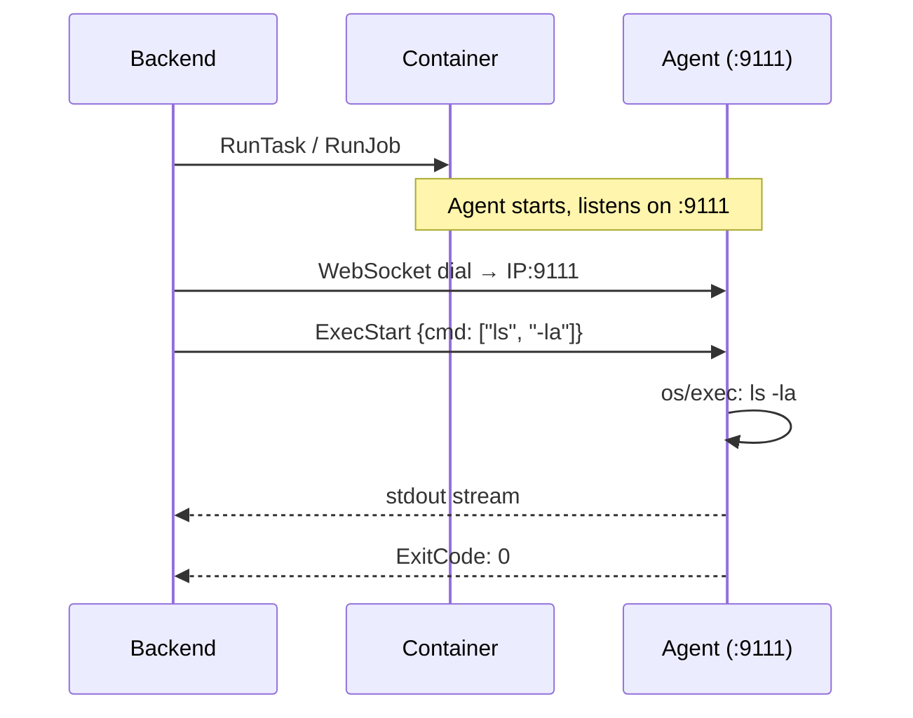

### Reverse Mode (Simulator / FaaS)

The agent dials *out* to the backend via a callback URL. No inbound connectivity needed.

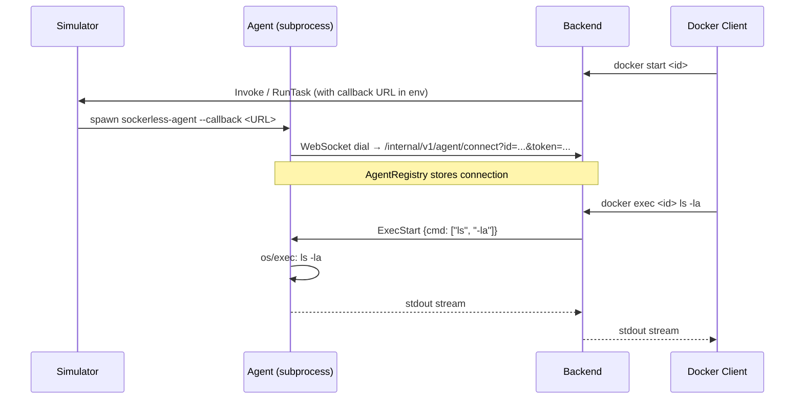

### Entrypoint Wrapping

The backend wraps the user's command with the agent binary at container creation time:

```
# Forward mode (keep-alive, listens on :9111)
Original:  ["python", "app.py"]
Wrapped:   ["/sockerless/bin/sockerless-agent", "--addr", ":9111", "--keep-alive", "--", "python", "app.py"]

# Reverse mode (callback, dials backend)
Original:  ["python", "app.py"]
Wrapped:   ["/sockerless/bin/sockerless-agent", "--callback", "<url>", "--keep-alive", "--", "python", "app.py"]
```

The agent runs the original command as its main process and handles exec/attach requests concurrently.

---

## Production Use Cases

Sockerless is a drop-in replacement for Docker Engine. Anything that talks to the Docker REST API works — CI runners, Docker Compose, test frameworks, custom SDK clients. All three standard `DOCKER_HOST` connection modes are supported:

| Mode | `DOCKER_HOST` | How it works |
|------|---------------|--------------|
| Local TCP | `tcp://localhost:2375` | Client connects directly to frontend on same host |
| Remote TCP | `tcp://remote-host:2375` | Client connects to frontend on a different machine |
| SSH tunnel | `ssh://user@remote-host` | Docker CLI opens SSH tunnel to remote unix socket |

For SSH mode, the Sockerless frontend must listen on a unix socket (e.g., `/var/run/docker.sock`). The Docker CLI's built-in SSH transport tunnels to the socket over SSH — no extra configuration needed.

### Docker CLI and Compose

```bash
# Local — frontend on same machine
export DOCKER_HOST=tcp://localhost:2375
docker run --rm -p 8080:8080 my-app:latest

# Remote — frontend on a cloud VM
export DOCKER_HOST=tcp://sockerless.example.com:2375
docker run --rm alpine echo "running on remote cloud"

# SSH — tunnel to remote frontend's unix socket
export DOCKER_HOST=ssh://user@sockerless.example.com
docker run --rm alpine echo "running via SSH tunnel"

# Compose stack — each service becomes a cloud workload
docker compose up -d
docker compose logs -f
docker compose down
```

### TestContainers and Docker SDK Clients

Any library that uses the Docker HTTP REST API works without modification:

- **[TestContainers](https://testcontainers.com/)** (Java, Go, Python, .NET, Node, Rust) — integration tests that spin up databases, message queues, and other dependencies as containers
- **Docker SDK** (Go `docker/docker`, Python `docker-py`, Java `docker-java`, etc.) — custom orchestration code
- **Drone CI, Woodpecker CI, Buildkite** — any CI system that talks to Docker

All of these just need `DOCKER_HOST` pointed at the Sockerless frontend. Containers run on whichever cloud backend is configured.

### CI Runners — GitHub Actions & GitLab CI

The production deployment model for CI is the same: a **self-hosted runner** registers with the upstream CI service (github.com or gitlab.com), receives jobs, and uses Sockerless as its Docker daemon. The runner doesn't know or care that Docker is absent — it issues standard Docker API calls, and Sockerless routes them to the configured cloud backend.

### GitHub Actions (production)

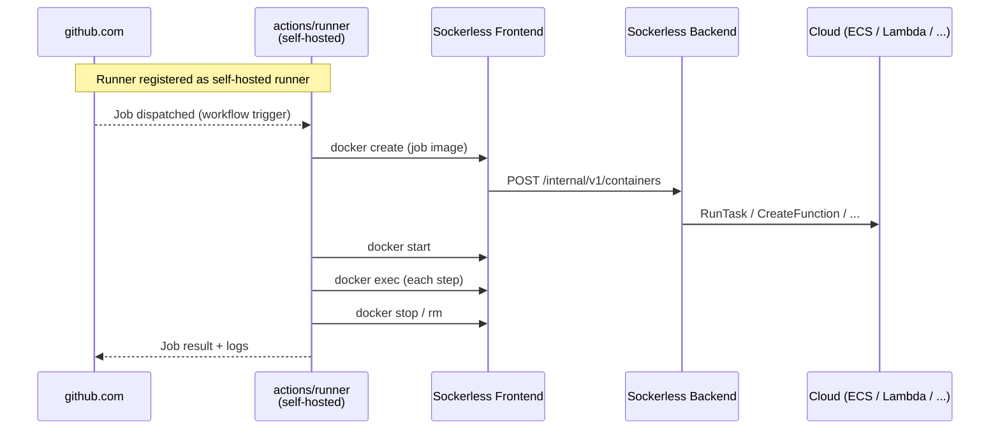

The runner is configured with `DOCKER_HOST` pointing at the Sockerless frontend. GitHub dispatches jobs to it like any self-hosted runner. No modifications to the runner binary, no custom actions — standard GitHub Actions workflows work unchanged.

### GitLab CI (production)

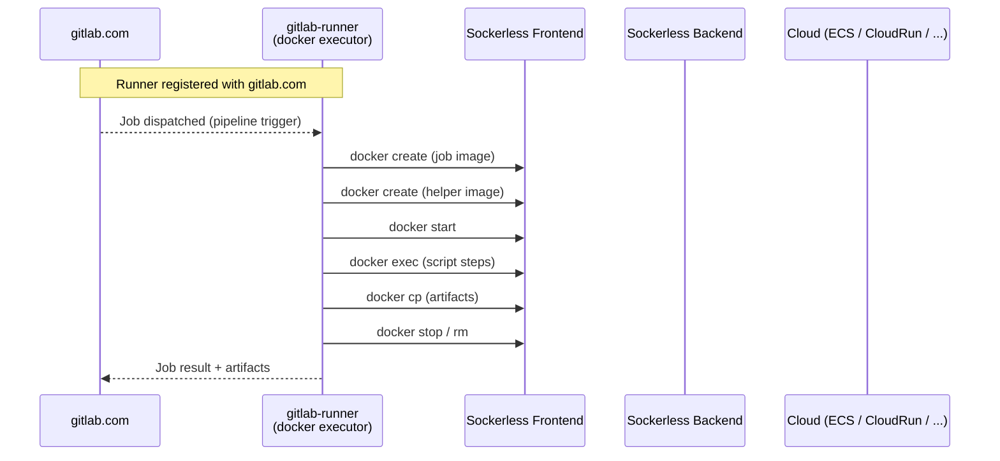

GitLab Runner's docker executor talks directly to the Docker API. By setting `host` in the runner's `config.toml` to the Sockerless frontend address (`tcp://localhost:2375`), all container operations route through Sockerless. No runner modifications needed.

### bleephub — Local GitHub API Simulator

For **local testing** without github.com, `bleephub/` (`bleephub/`) implements the internal Azure DevOps-derived runner service API that the official `actions/runner` speaks. This lets us run the real runner binary in a fully offline test harness.

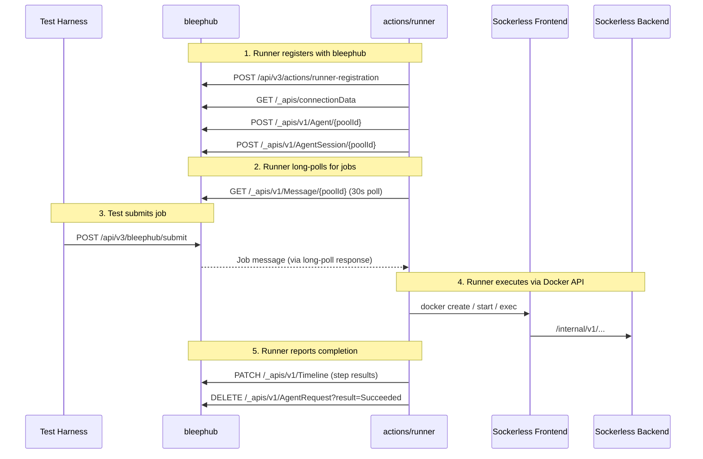

bleephub also implements enough of the GitHub REST/GraphQL API and Git smart HTTP protocol for `gh` CLI and `actions/checkout` to work locally.

| Service Group | Purpose |
|--------------|---------|
| **Auth & discovery** | Runner registration, connection data (service GUIDs), JWT tokens |
| **Agent management** | Agent pools, registration, labels, status |
| **Broker** | Session creation, message long-poll (30s), job delivery via Go channels |
| **Run service** | Job acquire/renew/complete lifecycle |
| **Timeline & logs** | Step status tracking, log upload, web console output |
| **GitHub API** | REST + GraphQL (repos, orgs, teams, users) for `gh` CLI and runner context |
| **Git HTTP** | Smart HTTP protocol (`go-git`) for `actions/checkout` |

**Current scope:** `run:` (script) steps only. `uses:` (marketplace actions), multi-job workflows, matrix strategies, artifacts, caching, and secrets are planned (see PLAN.md phases 42+).

---

## Memory Backend + WASM Sandbox

The memory backend runs containers entirely in-process using a WebAssembly sandbox. No cloud resources, no Docker daemon, no containers — just WASM.

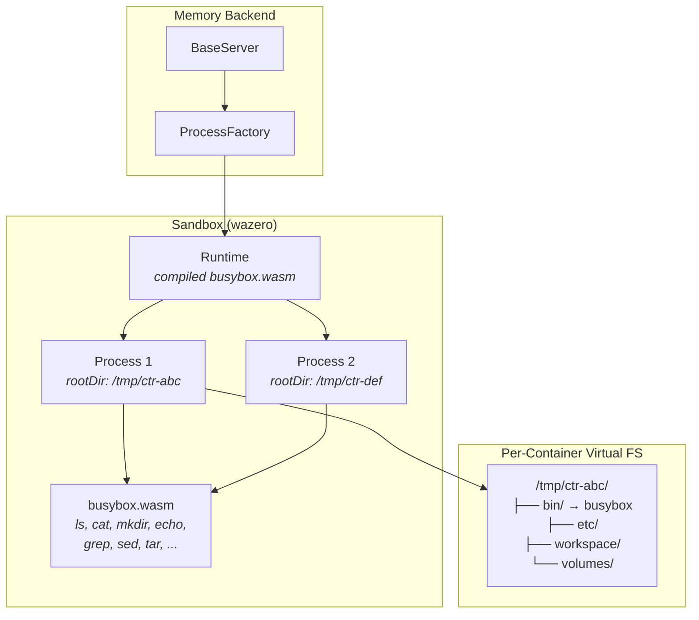

Each container gets:
- A temp directory as its root filesystem, populated with an Alpine-like layout
- Volume mounts mapped to host directories
- A shell interpreter (`mvdan.cc/sh`) that executes commands using the compiled busybox WASM module
- Isolated stdout/stderr capture for logs and attach

The busybox WASM binary is built from `go-busybox` via TinyGo and embedded in the Go binary at compile time. It provides ~30 common Unix utilities (ls, cat, mkdir, cp, grep, sed, tar, etc.).

---

## Simulators

Simulators (`simulators/{aws,gcp,azure}/`) are standalone HTTP servers that implement subsets of cloud APIs. They allow backends to run against local fake infrastructure for testing.

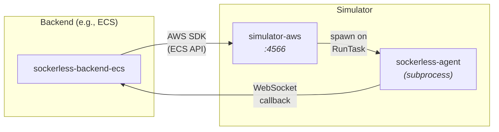

Key points:
- Simulators are **decoupled** from backends. They don't import backend code.
- Backends talk to simulators via standard cloud SDKs pointed at `localhost` via `SOCKERLESS_ENDPOINT_URL`.
- When a simulator receives a task/function invoke and sees `SOCKERLESS_AGENT_CALLBACK_URL` in the environment, it spawns an agent subprocess that dials back to the backend.
- Each cloud has its own simulator on a dedicated port: AWS `:4566`, GCP `:4567`, Azure `:4568`.

### Simulator Coverage

| Simulator | APIs Implemented |
|-----------|-----------------|
| **AWS** | ECS (clusters, task defs, tasks), Lambda (functions, invoke), ECR (auth, manifests), CloudWatch Logs |
| **GCP** | Cloud Run Services, Cloud Run Jobs, Cloud Functions, Artifact Registry, Cloud Logging |
| **Azure** | Container Apps Environments/Jobs, Functions, App Service Plans, ACR, Storage (blob), Resource Groups |

---

## Module Structure

The project is organized as a Go workspace with 15+ modules:

```
sockerless/
├── api/                          # Shared types (zero deps)
├── frontends/
│   └── docker/                   # Docker REST API frontend
├── backends/
│   ├── core/                     # Shared backend library
│   ├── memory/                   # WASM sandbox backend
│   ├── docker/                   # Docker daemon passthrough
│   ├── ecs/                      # AWS ECS/Fargate
│   ├── lambda/                   # AWS Lambda
│   ├── cloudrun/                 # GCP Cloud Run Jobs
│   ├── cloudrun-functions/       # GCP Cloud Run Functions
│   ├── aca/                      # Azure Container Apps Jobs
│   └── azure-functions/          # Azure Functions
├── agent/                        # WebSocket agent binary
├── sandbox/                      # WASM runtime (wazero + busybox)
├── bleephub/                     # GitHub Actions runner service API
├── simulators/
│   ├── aws/                      # AWS API simulator
│   ├── gcp/                      # GCP API simulator
│   └── azure/                    # Azure API simulator
├── terraform/                    # IaC modules for real deployment
└── tests/                        # Integration + E2E tests
```

Each backend, simulator, and the sandbox are separate Go modules connected via `go.work`. Simulators are **not** in the workspace (built with `GOWORK=off`) to avoid dependency conflicts with cloud SDKs.

---

## Test Architecture

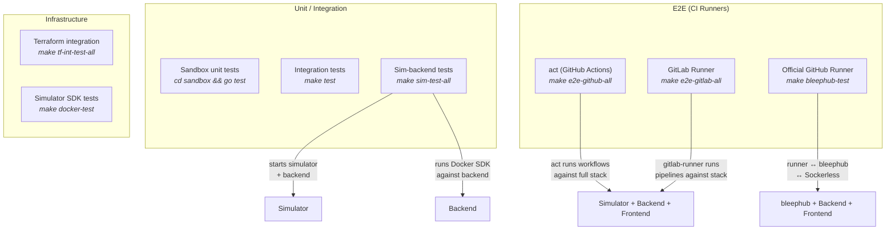

- **Sim-backend tests**: Start a simulator + backend pair, run 108 Docker SDK tests against them.
- **E2E tests (act + GitLab)**: Start the full stack (simulator + backend + frontend), run real CI workflows (GitHub Actions via `act`, GitLab CI via `gitlab-runner`) that exercise container create/start/exec/stop/remove.
- **E2E tests (official runner)**: Start bleephub + Sockerless, run the official `actions/runner` through the full job lifecycle (`make bleephub-test`, Docker-only).
- **Terraform integration tests**: Apply real Terraform modules against simulators to verify IaC compatibility.
