# Sockerless Architecture

Sockerless implements the Docker API without Docker. Any Docker client (CLI, SDK, CI runner) can connect to Sockerless and run containers backed by cloud services (AWS ECS, Lambda, GCP Cloud Run, Cloud Functions, Azure Container Apps, Azure Functions).

The production goal: **replace Docker Engine with Sockerless and run containers on real cloud infrastructure.** Any program that talks to Docker — `docker run`, `docker compose`, CI runners (GitHub Actions, GitLab CI), test frameworks (TestContainers), or custom Docker SDK clients — works unchanged. Set `DOCKER_HOST` to point at Sockerless, and every container operation becomes a cloud API call to ECS, Lambda, Cloud Run, or whichever backend is configured.

## High-Level Overview

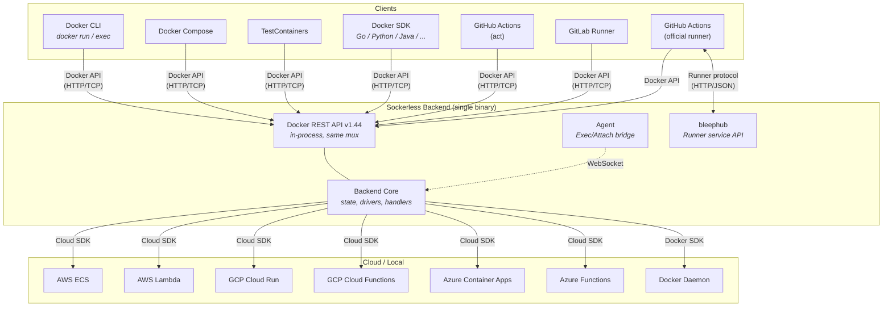
```mermaid
graph TB
    subgraph Clients
        CLI["Docker CLI<br/><i>docker run / exec</i>"]
        COMPOSE["Docker Compose"]
        TC["TestContainers"]
        SDK["Docker SDK<br/><i>Go / Python / Java / ...</i>"]
        ACT["GitHub Actions<br/>(act)"]
        GHR["GitHub Actions<br/>(official runner)"]
        GLR["GitLab Runner"]
    end

    subgraph "Sockerless Backend (single binary)"
        DOCKER_API["Docker REST API v1.44<br/><i>in-process, same mux</i>"]
        CORE["Backend Core<br/><i>state, drivers, handlers</i>"]
        AG["Agent<br/><i>Exec/Attach bridge</i>"]
        BPH["bleephub<br/><i>Runner service API</i>"]
    end

    subgraph "Cloud / Local"
        ECS["AWS ECS"]
        LAM["AWS Lambda"]
        CR["GCP Cloud Run"]
        GCF["GCP Cloud Functions"]
        ACA["Azure Container Apps"]
        AZF["Azure Functions"]
        DOCK["Docker Daemon"]
    end

    CLI & COMPOSE & TC & SDK & ACT & GLR -->|"Docker API<br/>(HTTP/TCP)"| DOCKER_API
    GHR -->|"Docker API"| DOCKER_API
    GHR <-->|"Runner protocol<br/>(HTTP/JSON)"| BPH
    DOCKER_API --- CORE
    CORE -->|"Cloud SDK"| ECS & LAM & CR & GCF & ACA & AZF
    CORE -->|"Docker SDK"| DOCK
    AG -.->|"WebSocket"| CORE
```

Each backend is a **standalone binary** that serves both the Docker REST API (`:2375`) and internal management endpoints on the same HTTP mux — there is no separate frontend process. The Docker API routes are registered in-process via `core.BaseServer.registerDockerAPIRoutes()`, with a `stripVersionPrefix` middleware that removes the `/v1.XX/` prefix.

The system has three main components:

- **Backend** — Single-binary server implementing the Docker REST API v1.44 and managing container lifecycle. Seven implementations share a common core (`backends/core/`).
- **Agent** — Binary injected into cloud containers for exec/attach. Bridges commands between the backend and the container's shell over WebSocket.
- **bleephub** — Local GitHub Actions runner service. Implements enough of GitHub's internal runner protocol for the official `actions/runner` to register, receive jobs, and execute them through the backend's Docker API.

---

## Docker API Layer

Each backend serves the full Docker API surface — containers, images, networks, volumes, exec, system — directly on its HTTP mux. A `stripVersionPrefix` middleware removes the `/v1.XX/` prefix so clients using any Docker API version work transparently. The same handlers serve both Docker-compatible routes (`/containers/create`) and internal routes (`/internal/v1/containers`).

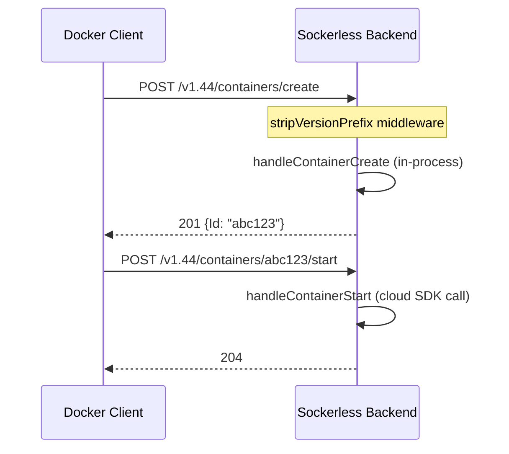
```mermaid
sequenceDiagram
    participant C as Docker Client
    participant S as Sockerless Backend

    C->>S: POST /v1.44/containers/create
    Note over S: stripVersionPrefix middleware
    S->>S: handleContainerCreate (in-process)
    S-->>C: 201 {Id: "abc123"}

    C->>S: POST /v1.44/containers/abc123/start
    S->>S: handleContainerStart (cloud SDK call)
    S-->>C: 204
```

For streaming operations (exec, attach, logs), the backend hijacks the HTTP connection and bridges bidirectional I/O with the agent or cloud logging service.

---

## Backends

All backends embed a shared `core.BaseServer` that provides HTTP routing (both Docker API and internal management endpoints), in-memory state (`Store`), agent registry, and default handlers. Each cloud backend overrides specific methods via the `api.Backend` interface (self-dispatch pattern) to implement cloud-specific logic.

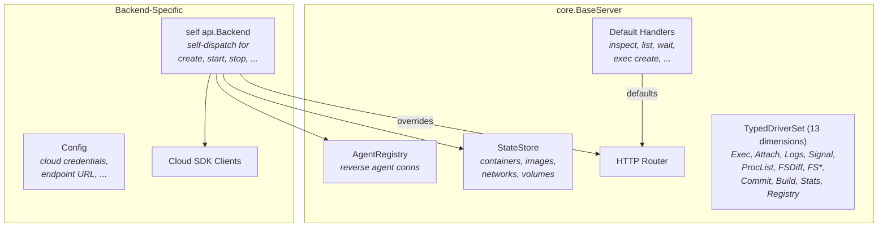
```mermaid
graph TB
    subgraph "core.BaseServer"
        MUX["HTTP Router"]
        STORE["StateStore<br/><i>containers, images,<br/>networks, volumes</i>"]
        REG["AgentRegistry<br/><i>reverse agent conns</i>"]
        DRV["TypedDriverSet (13 dimensions)<br/><i>Exec, Attach, Logs, Signal,<br/>ProcList, FSDiff, FS*,<br/>Commit, Build, Stats, Registry</i>"]
        DH["Default Handlers<br/><i>inspect, list, wait,<br/>exec create, ...</i>"]
    end

    subgraph "Backend-Specific"
        SELF["self api.Backend<br/><i>self-dispatch for<br/>create, start, stop, ...</i>"]
        CFG["Config<br/><i>cloud credentials,<br/>endpoint URL, ...</i>"]
        SDK2["Cloud SDK Clients"]
    end

    SELF -->|overrides| MUX
    DH -->|defaults| MUX
    SELF --> STORE
    SELF --> REG
    SELF --> SDK2
```

### Backend Matrix

| Backend | Cloud Service | Agent Mode | Execution |
|---------|--------------|------------|-----------|
| **docker** | — | — | Docker daemon passthrough |
| **ecs** | ECS/Fargate | Forward or Reverse | Real container |
| **lambda** | Lambda | Reverse | Function invoke |
| **cloudrun** | Cloud Run Jobs / Services | Reverse for runner/Service path | Job execution or Service revision |
| **gcf** | Cloud Run Functions | Reverse | Function invoke |
| **aca** | Container Apps Jobs / Apps | Reverse for runner/App path | Job execution or App revision |
| **azf** | Azure Functions | Reverse | Function invoke |

**Docker backend** proxies to a real Docker daemon — no agent needed.

**Container backends:**
- **ECS** uses SSM ExecuteCommand for in-container ops (exec / top / stat / cp / find / kill). No agent in the user image required.
- **Cloud Run + ACA Apps** use the **reverse agent** — sockerless ships a small bootstrap as the container entrypoint; the bootstrap dials `SOCKERLESS_CALLBACK_URL` over WebSocket; the backend uses that connection to drive exec / fs ops. ACA Jobs remain execution-scoped and are not the runner exec path.

**FaaS backends** (Lambda, GCF, AZF) always use the **reverse agent** — inbound connections aren't possible, so the bootstrap inside the function dials out via the callback URL.

The driver framework hides these per-backend details behind 13 typed dimensions; per-cloud cloud-native typed drivers (e.g. SSM-based ProcList for ECS, reverse-agent-based ProcList for FaaS) plug into the same `TypedDriverSet.ProcList` slot. See [specs/DRIVERS.md](specs/DRIVERS.md) for the per-backend matrix.

---

## Container Lifecycle

Every backend presents the same Docker API states — Created, Running, Exited — but the underlying cloud operations differ. The generic state machine is:

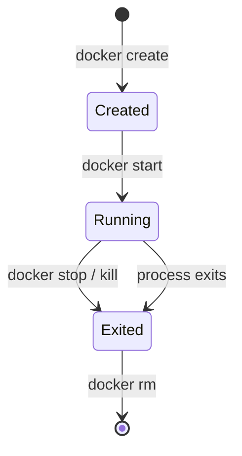
```mermaid
stateDiagram-v2
    [*] --> Created: docker create
    Created --> Running: docker start
    Running --> Exited: docker stop / kill
    Running --> Exited: process exits
    Exited --> [*]: docker rm
```

While running, `docker exec` executes commands inside the container (see [Exec Routing](#exec-routing) below).

### Per-Backend Lifecycle

#### Docker (passthrough)

All operations proxy to the local Docker daemon via the Docker SDK.

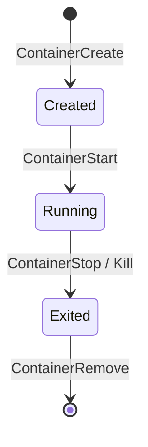
```mermaid
stateDiagram-v2
    [*] --> Created: ContainerCreate
    Created --> Running: ContainerStart
    Running --> Exited: ContainerStop / Kill
    Exited --> [*]: ContainerRemove
```

#### ECS (AWS Fargate)

Task definition registration is **deferred** from Create to Start for pod association. Exec uses the ECS ExecuteCommand / SSM path.

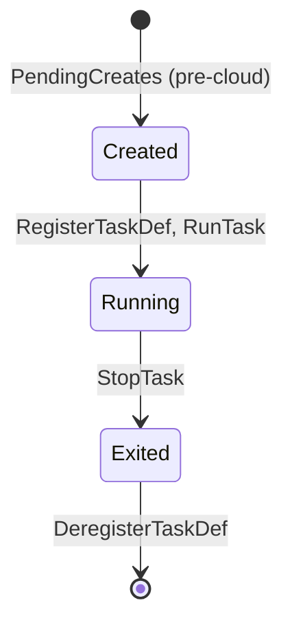
```mermaid
stateDiagram-v2
    [*] --> Created: PendingCreates (pre-cloud)
    Created --> Running: RegisterTaskDef, RunTask
    Running --> Exited: StopTask
    Exited --> [*]: DeregisterTaskDef
```

| Operation | Cloud API Calls |
|-----------|----------------|
| Create | `PendingCreates` only until Start materializes the ECS task definition |
| Start | `ECS.RegisterTaskDefinition`, `ECS.RunTask`, `CloudMap.RegisterInstance` |
| Exec | `ECS.ExecuteCommand` (SSM) |
| Stop/Kill | `ECS.StopTask` |
| Remove | `ECS.DeregisterTaskDefinition`, `CloudMap.DeregisterInstance` |
| Logs | `CloudWatch.GetLogEvents` |
| Network | VPC Security Groups (create/delete/self-referencing ingress) |
| Service Discovery | AWS Cloud Map (private DNS namespace, service registration) |

#### Lambda (AWS FaaS)

Functions are created eagerly at Create time. Invoke is asynchronous — the agent dials back via callback URL (reverse mode only).

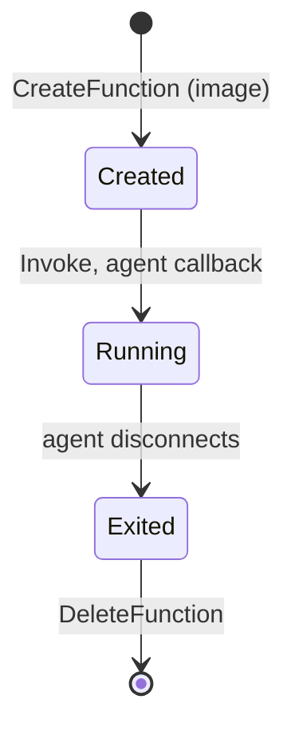
```mermaid
stateDiagram-v2
    [*] --> Created: CreateFunction (image)
    Created --> Running: Invoke, agent callback
    Running --> Exited: agent disconnects
    Exited --> [*]: DeleteFunction
```

| Operation | Cloud API Calls |
|-----------|----------------|
| Create | `Lambda.CreateFunction` (image-based) |
| Start | `Lambda.Invoke` (async), agent dials back via `SOCKERLESS_CALLBACK_URL` |
| Exec | Reverse agent WebSocket only |
| Stop/Kill | State transition (agent disconnect) |
| Remove | `Lambda.DeleteFunction` |
| Logs | `CloudWatch.GetLogEvents` (`/aws/lambda/{functionName}`) |

#### Cloud Run Jobs/Services (GCP)

Cloud resource creation is **deferred** from Create to Start. One-shot containers use Jobs; runner and repeated-exec workloads use Services with the reverse-agent bootstrap. Cloud DNS and Service materialization handle service discovery.

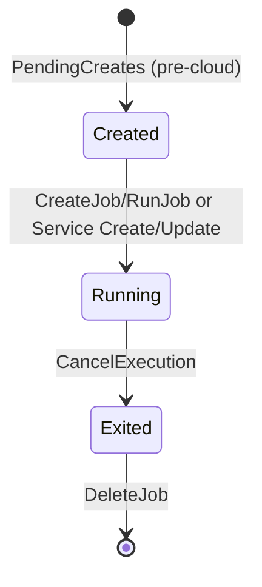
```mermaid
stateDiagram-v2
    [*] --> Created: PendingCreates (pre-cloud)
    Created --> Running: CreateJob/RunJob or Service Create/Update
    Running --> Exited: CancelExecution
    Exited --> [*]: DeleteJob
```

| Operation | Cloud API Calls |
|-----------|----------------|
| Create | `PendingCreates` only until Start materializes the Job or Service |
| Start | `Jobs.CreateJob`, `Jobs.RunJob`, `Services.CreateService` / `Services.UpdateService`, `CloudDNS.CreateResourceRecord` |
| Exec | Reverse agent WebSocket for Service-backed workloads |
| Stop/Kill | `Jobs.CancelExecution` |
| Remove | `Jobs.DeleteJob` or `Services.DeleteService`, `CloudDNS.DeleteResourceRecord` |
| Logs | `Cloud Logging` (resource.type=cloud_run_job) |
| Network | Cloud DNS managed zones (create/delete/record cleanup) |
| Service Discovery | Cloud DNS A records (register/deregister/resolve by FQDN) |

#### Cloud Run Functions (GCP FaaS)

Functions are created eagerly. Invoked via HTTP POST. Reverse agent only.

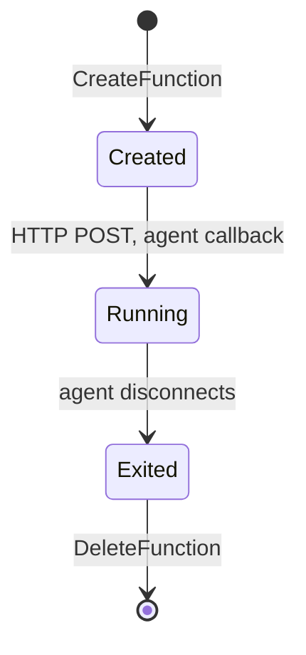
```mermaid
stateDiagram-v2
    [*] --> Created: CreateFunction
    Created --> Running: HTTP POST, agent callback
    Running --> Exited: agent disconnects
    Exited --> [*]: DeleteFunction
```

| Operation | Cloud API Calls |
|-----------|----------------|
| Create | `Functions.CreateFunction` (2nd gen, Docker runtime) |
| Start | HTTP POST to `ServiceConfig.Uri`, agent dials back |
| Exec | Reverse agent WebSocket only |
| Stop/Kill | State transition (agent disconnect) |
| Remove | `Functions.DeleteFunction` |
| Logs | `Cloud Logging` (resource.type=cloud_run_revision) |

#### ACA Jobs/Apps (Azure Container Apps)

Cloud resource creation is **deferred** from Create to Start. One-shot containers use Jobs; runner and repeated-exec workloads use Apps with the reverse-agent bootstrap. There is no Container Apps management-API exec fallback.

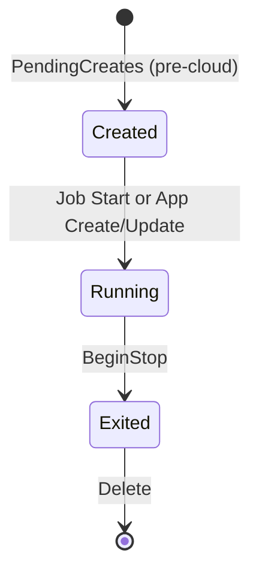
```mermaid
stateDiagram-v2
    [*] --> Created: PendingCreates (pre-cloud)
    Created --> Running: Job Start or App Create/Update
    Running --> Exited: BeginStop
    Exited --> [*]: Delete
```

| Operation | Cloud API Calls |
|-----------|----------------|
| Create | `PendingCreates` only until Start materializes the Job or App |
| Start | `Jobs.BeginCreateOrUpdate` + `Jobs.BeginStart`, or `ContainerApps.BeginCreateOrUpdate` |
| Exec | Reverse agent WebSocket for App-backed workloads |
| Stop/Kill | `Jobs.BeginStop` |
| Remove | `Jobs.Delete` |
| Logs | Azure Monitor / Log Analytics (AppTraces) |
| Network | NSG name/rule tracking |
| Service Discovery | In-process DNS registry (hostname→IP per network) |

#### Azure Functions (FaaS)

Function Apps are created eagerly. Invoked via HTTP POST. Reverse agent only.

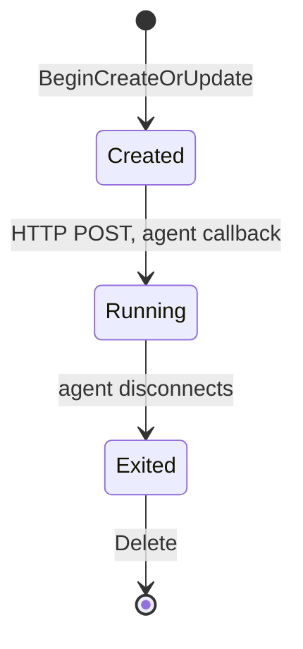
```mermaid
stateDiagram-v2
    [*] --> Created: BeginCreateOrUpdate
    Created --> Running: HTTP POST, agent callback
    Running --> Exited: agent disconnects
    Exited --> [*]: Delete
```

| Operation | Cloud API Calls |
|-----------|----------------|
| Create | `WebApps.BeginCreateOrUpdate` (Function App site) |
| Start | HTTP POST to `DefaultHostName`, agent dials back |
| Exec | Reverse agent WebSocket only |
| Stop/Kill | State transition (agent disconnect) |
| Remove | `WebApps.Delete` |
| Logs | Azure Monitor / Log Analytics (AppTraces) |

### Key Patterns

- **Deferred creation**: ECS, Cloud Run, and ACA keep only `PendingCreates` between `docker create` and `docker start`; after Start, cloud APIs are the source of truth. FaaS backends (Lambda, GCF, AZF) create eagerly.
- **Exec transport**: ECS uses `ExecuteCommand` (SSM Session Manager WebSocket). Cloud Run Services, ACA Apps, Lambda, GCF, and AZF use mandatory reverse-agent WebSockets.
- **Cloud-native networking**: ECS uses VPC Security Groups + Cloud Map, Cloud Run uses Cloud DNS / Service materialization, and ACA uses managed-environment networking + Private DNS.

### Exec Routing

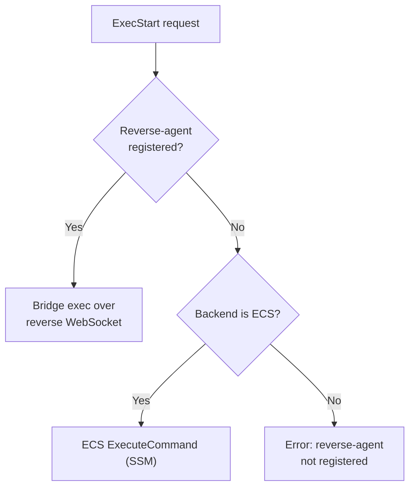
```mermaid
flowchart TD
    START["ExecStart request"] --> CHK1{"Reverse-agent<br/>registered?"}
    CHK1 -->|Yes| REV["Bridge exec over<br/>reverse WebSocket"]
    CHK1 -->|No| CHK2{"Backend is ECS?"}
    CHK2 -->|Yes| CLOUD["ECS ExecuteCommand (SSM)"]
    CHK2 -->|No| ERR["Error: reverse-agent<br/>not registered"]
```

1. **Reverse agent** — Agent has an active WebSocket to the backend. Exec is bridged over that connection.
2. **ECS SSM** — ECS uses Session Manager for cloud-native exec.
3. **No reverse-agent** — FaaS/Service/App backends fail loudly; there is no invoke-per-exec or ACA management-API fallback.

---

## The Agent

The agent (`agent/`) is a small binary injected into every container's entrypoint. It handles exec and attach by bridging commands between the backend and the container's shell over WebSocket.

### Forward Mode (Production)

The agent listens on `:9111` inside the container. The backend discovers the container's IP and dials in.

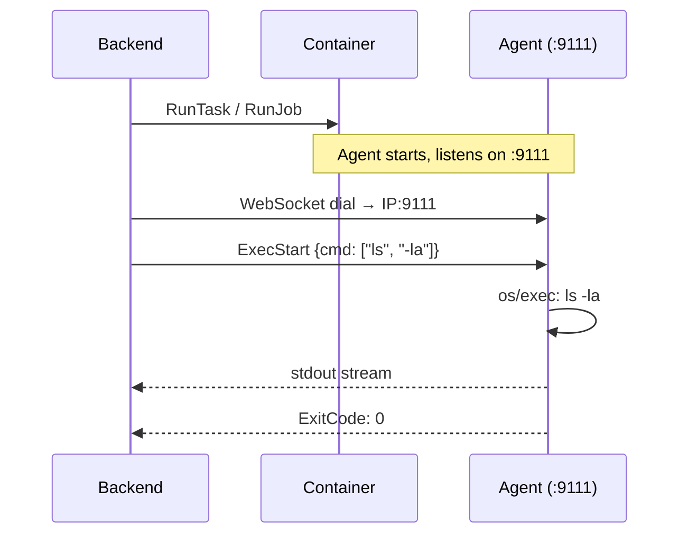
```mermaid
sequenceDiagram
    participant B as Backend
    participant C as Container
    participant A as Agent (:9111)

    B->>C: RunTask / RunJob
    Note over C,A: Agent starts, listens on :9111
    B->>A: WebSocket dial → IP:9111
    B->>A: ExecStart {cmd: ["ls", "-la"]}
    A->>A: os/exec: ls -la
    A-->>B: stdout stream
    A-->>B: ExitCode: 0
```

### Reverse Mode (Simulator / FaaS)

The agent dials *out* to the backend via a callback URL. No inbound connectivity needed.

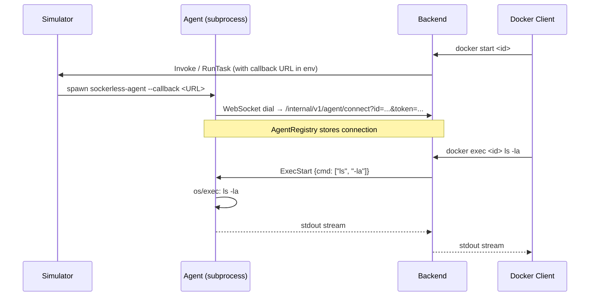
```mermaid
sequenceDiagram
    participant SIM as Simulator
    participant A as Agent (subprocess)
    participant B as Backend
    participant CL as Docker Client

    CL->>B: docker start <id>
    B->>SIM: Invoke / RunTask (with callback URL in env)
    SIM->>A: spawn sockerless-agent --callback <URL>
    A->>B: WebSocket dial → /internal/v1/agent/connect?id=...&token=...
    Note over B,A: AgentRegistry stores connection

    CL->>B: docker exec <id> ls -la
    B->>A: ExecStart {cmd: ["ls", "-la"]}
    A->>A: os/exec: ls -la
    A-->>B: stdout stream
    B-->>CL: stdout stream
```

### Entrypoint Wrapping

The backend wraps the user's command with the agent binary at container creation time:

```
# Forward mode (keep-alive, listens on :9111)
Original:  ["python", "app.py"]
Wrapped:   ["/sockerless/bin/sockerless-agent", "--addr", ":9111", "--keep-alive", "--", "python", "app.py"]

# Reverse mode (callback, dials backend)
Original:  ["python", "app.py"]
Wrapped:   ["/sockerless/bin/sockerless-agent", "--callback", "<url>", "--keep-alive", "--", "python", "app.py"]
```

The agent runs the original command as its main process and handles exec/attach requests concurrently.

---

## Production Use Cases

Sockerless is a drop-in replacement for Docker Engine. Anything that talks to the Docker REST API works — CI runners, Docker Compose, test frameworks, custom SDK clients. All three standard `DOCKER_HOST` connection modes are supported:

| Mode | `DOCKER_HOST` | How it works |
|------|---------------|--------------|
| Local TCP | `tcp://localhost:2375` | Client connects directly to backend on same host |
| Remote TCP | `tcp://remote-host:2375` | Client connects to backend on a different machine |
| SSH tunnel | `ssh://user@remote-host` | Docker CLI opens SSH tunnel to remote unix socket |

For SSH mode, the Sockerless backend must listen on a unix socket (e.g., `/var/run/docker.sock`). The Docker CLI's built-in SSH transport tunnels to the socket over SSH — no extra configuration needed.

### Docker CLI and Compose

```bash
# Local — backend on same machine
export DOCKER_HOST=tcp://localhost:2375
docker run --rm -p 8080:8080 my-app:latest

# Remote — backend on a cloud VM
export DOCKER_HOST=tcp://sockerless.example.com:2375
docker run --rm alpine echo "running on remote cloud"

# SSH — tunnel to remote backend's unix socket
export DOCKER_HOST=ssh://user@sockerless.example.com
docker run --rm alpine echo "running via SSH tunnel"

# Compose stack — each service becomes a cloud workload
docker compose up -d
docker compose logs -f
docker compose down
```

### TestContainers and Docker SDK Clients

Any library that uses the Docker HTTP REST API works without modification:

- **[TestContainers](https://testcontainers.com/)** (Java, Go, Python, .NET, Node, Rust) — integration tests that spin up databases, message queues, and other dependencies as containers
- **Docker SDK** (Go `docker/docker`, Python `docker-py`, Java `docker-java`, etc.) — custom orchestration code
- **Drone CI, Woodpecker CI, Buildkite** — any CI system that talks to Docker

All of these just need `DOCKER_HOST` pointed at the Sockerless backend. Containers run on whichever cloud backend is configured.

### CI Runners — GitHub Actions & GitLab CI

The production deployment model for CI is the same: a **self-hosted runner** registers with the upstream CI service (github.com or gitlab.com), receives jobs, and uses Sockerless as its Docker daemon. The runner doesn't know or care that Docker is absent — it issues standard Docker API calls, and Sockerless routes them to the configured cloud backend.

### GitHub Actions (production)

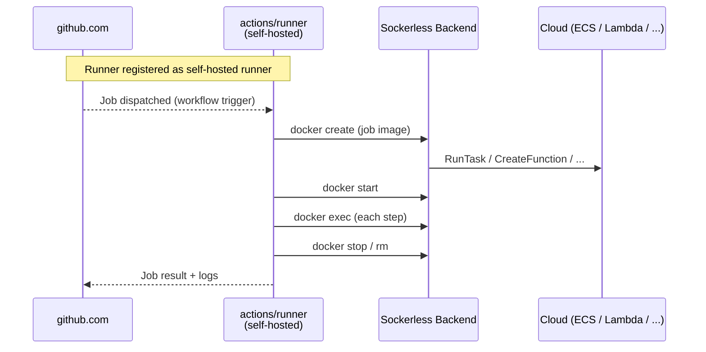
```mermaid
sequenceDiagram
    participant GH as github.com
    participant R as actions/runner<br/>(self-hosted)
    participant S as Sockerless Backend
    participant CL as Cloud (ECS / Lambda / ...)

    Note over GH,R: Runner registered as self-hosted runner
    GH-->>R: Job dispatched (workflow trigger)
    R->>S: docker create (job image)
    S->>CL: RunTask / CreateFunction / ...
    R->>S: docker start
    R->>S: docker exec (each step)
    R->>S: docker stop / rm
    R-->>GH: Job result + logs
```

The runner is configured with `DOCKER_HOST` pointing at the Sockerless backend. GitHub dispatches jobs to it like any self-hosted runner. No modifications to the runner binary, no custom actions — standard GitHub Actions workflows work unchanged.

### GitLab CI (production)

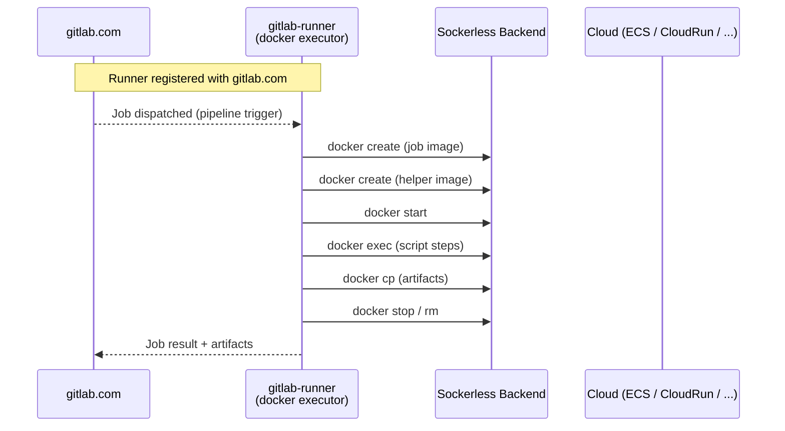
```mermaid
sequenceDiagram
    participant GL as gitlab.com
    participant R as gitlab-runner<br/>(docker executor)
    participant S as Sockerless Backend
    participant CL as Cloud (ECS / CloudRun / ...)

    Note over GL,R: Runner registered with gitlab.com
    GL-->>R: Job dispatched (pipeline trigger)
    R->>S: docker create (job image)
    R->>S: docker create (helper image)
    R->>S: docker start
    R->>S: docker exec (script steps)
    R->>S: docker cp (artifacts)
    R->>S: docker stop / rm
    R-->>GL: Job result + artifacts
```

GitLab Runner's docker executor talks directly to the Docker API. By setting `host` in the runner's `config.toml` to the Sockerless backend address (`tcp://localhost:2375`), all container operations route through Sockerless. No runner modifications needed.

### bleephub — Local GitHub API Simulator

For **local testing** without github.com, `bleephub/` implements enough of the GitHub Actions runner service API for the official `actions/runner` binary to register, receive jobs, execute them, and report results. This lets us run the real runner in a fully offline test harness.

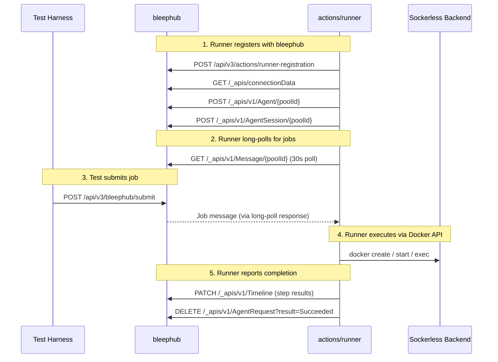
```mermaid
sequenceDiagram
    participant J as Test Harness
    participant BPH as bleephub
    participant R as actions/runner
    participant S as Sockerless Backend

    Note over BPH,R: 1. Runner registers with bleephub
    R->>BPH: POST /api/v3/actions/runner-registration
    R->>BPH: GET /_apis/connectionData
    R->>BPH: POST /_apis/v1/Agent/{poolId}
    R->>BPH: POST /_apis/v1/AgentSession/{poolId}

    Note over BPH,R: 2. Runner long-polls for jobs
    R->>BPH: GET /_apis/v1/Message/{poolId} (30s poll)

    Note over J,BPH: 3. Test submits job
    J->>BPH: POST /api/v3/bleephub/submit
    BPH-->>R: Job message (via long-poll response)

    Note over R,S: 4. Runner executes via Docker API
    R->>S: docker create / start / exec

    Note over BPH,R: 5. Runner reports completion
    R->>BPH: PATCH /_apis/v1/Timeline (step results)
    R->>BPH: DELETE /_apis/v1/AgentRequest?result=Succeeded
```

bleephub also implements enough of the GitHub REST/GraphQL API and Git smart HTTP protocol for `gh` CLI and `actions/checkout` to work locally.

| Service Group | Purpose |
|--------------|---------|
| **Auth & discovery** | Runner registration, connection data (service GUIDs), JWT tokens |
| **Agent management** | Agent pools, registration, labels, status |
| **Broker** | Session creation, message long-poll (30s), job delivery via Go channels |
| **Run service** | Job acquire/renew/complete lifecycle |
| **Timeline & logs** | Step status tracking, log upload, web console output |
| **GitHub API** | REST + GraphQL — repos, orgs, teams, users, issues, PRs, PR review comments + threads, reactions, releases, deployments + environments, Checks, GitHub Apps + installations + permission-scoped installation tokens, OAuth Apps, webhooks + deliveries, Actions OIDC (`/token` + `/.well-known/jwks`), Pages, branch protection, marketplace. Direct `gh` CLI compatibility; see [docs/BLEEPHUB_GH_CLI.md](docs/BLEEPHUB_GH_CLI.md) |
| **Git HTTP** | Smart HTTP protocol (`go-git`) for `actions/checkout` |
| **Persistence** | Optional SQLite write-through (`BLEEPHUB_PERSIST=true`) — users, tokens, apps, oauth_apps, installations, installation_tokens, user_to_server_tokens, refresh_tokens, repos |

**Current scope:** Full GitHub Actions workflow execution — multi-job workflows with `needs:` dependencies, matrix strategies (`strategy.matrix`), secrets injection, expression evaluation (`${{ }}` syntax), concurrency groups with cancel-in-progress, persistent artifacts, and `uses:` actions (docker container actions). Both `run:` (script) and `uses: docker://` steps are supported. Output passing between steps and jobs works via `$GITHUB_OUTPUT`. GitHub Apps installation tokens (`ghs_`), user-to-server tokens (`ghu_`), and OAuth user tokens (`gho_`) flow through `requirePerm(scope, level)` enforcement on write-class endpoints. See [bleephub/README.md](bleephub/README.md) and [specs/BLEEPHUB_GITHUB_API_PARITY.md](specs/BLEEPHUB_GITHUB_API_PARITY.md) for the per-endpoint inventory.

---

## Simulators

Simulators (`simulators/{aws,gcp,azure}/`) are standalone HTTP servers that implement the local cloud-slice APIs sockerless touches. They allow backends, SDKs, CLIs, and Terraform providers to run against a local endpoint while preserving cloud-shaped request/response semantics.

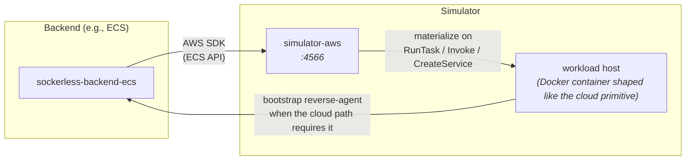
```mermaid
graph LR
    subgraph "Backend (e.g., ECS)"
        BE2["sockerless-backend-ecs"]
    end

    subgraph "Simulator"
        SIM2["simulator-aws<br/><i>:4566</i>"]
        HOST["workload host<br/><i>(Docker container shaped like the cloud primitive)</i>"]
    end

    BE2 -->|"AWS SDK<br/>(ECS API)"| SIM2
    SIM2 -->|"materialize on<br/>RunTask / Invoke / CreateService"| HOST
    HOST -->|"bootstrap reverse-agent<br/>when the cloud path requires it"| BE2
```

Key points:
- Simulators are **decoupled** from backends. They don't import backend code.
- Backends talk to simulators via standard cloud SDKs pointed at `localhost` via `SOCKERLESS_ENDPOINT_URL`.
- When a simulator receives a task/function invoke or service/app create, it materializes a real local workload container shaped like that cloud primitive. If the workload image contains a sockerless bootstrap, that bootstrap dials the backend reverse-agent endpoint just as it would in the cloud.
- Each cloud has its own simulator on a dedicated port: AWS `:4566`, GCP `:4567`, Azure `:4568`.

### Simulator Coverage

| Simulator | APIs Implemented |
|-----------|-----------------|
| **AWS** | ECS (clusters, task defs, tasks), Lambda (functions, invoke), ECR (auth, manifests), CloudWatch Logs, EC2 (security groups), Cloud Map (service discovery), S3, IAM, STS |
| **GCP** | Cloud Run Jobs, Cloud Functions, Artifact Registry, Cloud Logging, Cloud DNS, Compute, IAM, VPC Access, Service Usage |
| **Azure** | Container Apps Environments/Jobs, Functions, App Service Plans, ACR, Storage (blob), Monitor, Private DNS, Network (NSG), Managed Identity, Resource Groups |

---

## Module Structure

The project is organized as a Go workspace with multiple modules:

```
sockerless/
├── api/                          # Shared types (zero deps)
├── backends/
│   ├── core/                     # Shared library (Docker API + internal handlers)
│   ├── docker/                   # Docker daemon passthrough
│   ├── ecs/                      # AWS ECS/Fargate
│   ├── lambda/                   # AWS Lambda
│   ├── cloudrun/                 # GCP Cloud Run Jobs
│   ├── cloudrun-functions/       # GCP Cloud Run Functions
│   ├── aca/                      # Azure Container Apps Jobs
│   └── azure-functions/          # Azure Functions
├── agent/                        # WebSocket agent binary
├── bleephub/                     # GitHub Actions runner service API
├── cmd/
│   ├── sockerless/               # CLI tool (context management)
│   └── sockerless-admin/         # Admin dashboard server
├── ui/                           # React SPA monorepo (14 packages)
├── simulators/
│   ├── aws/                      # AWS API simulator
│   ├── gcp/                      # GCP API simulator
│   └── azure/                    # Azure API simulator
├── terraform/                    # IaC modules for real deployment
└── tests/                        # Integration + E2E tests
```

Each backend and simulator is a separate Go module connected via `go.work`. Simulators are **not** in the workspace (built with `GOWORK=off`) to avoid dependency conflicts with cloud SDKs. Major components embed React dashboards (Bun/Vite/React 19/Tailwind 4) served at `/ui/`.

---

## Test Architecture

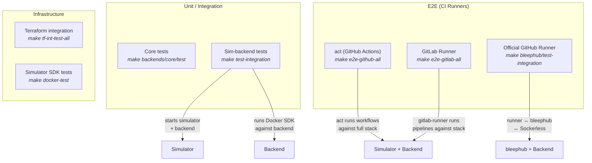
```mermaid
graph TB
    subgraph "Unit / Integration"
        IT["Core tests<br/><i>make backends/core/test</i>"]
        ST["Sim-backend tests<br/><i>make test-integration</i>"]
    end

    subgraph "E2E (CI Runners)"
        GH["act (GitHub Actions)<br/><i>make e2e-github-all</i>"]
        GL["GitLab Runner<br/><i>make e2e-gitlab-all</i>"]
        BPH["Official GitHub Runner<br/><i>make bleephub/test-integration</i>"]
    end

    subgraph "Infrastructure"
        TF["Terraform integration<br/><i>make tf-int-test-all</i>"]
        SDK3["Simulator SDK tests<br/><i>make docker-test</i>"]
    end

    ST -->|"starts simulator<br/>+ backend"| SIM3["Simulator"]
    ST -->|"runs Docker SDK<br/>against backend"| BE3["Backend"]
    GH -->|"act runs workflows<br/>against full stack"| STACK["Simulator + Backend"]
    GL -->|"gitlab-runner runs<br/>pipelines against stack"| STACK
    BPH -->|"runner ↔ bleephub<br/>↔ Sockerless"| BSTACK["bleephub + Backend"]
```

- **Sim-backend tests**: Start a simulator + backend pair, run 59 Docker SDK test functions against them.
- **E2E tests (act + GitLab)**: Start the full stack (simulator + backend), run real CI workflows (GitHub Actions via `act`, GitLab CI via `gitlab-runner`) that exercise container create/start/exec/stop/remove.
- **E2E tests (official runner)**: Start bleephub + Sockerless backend, run the official `actions/runner` through the full job lifecycle (`make bleephub/test-integration`, Docker-only).
- **Terraform integration tests**: Apply real Terraform modules against simulators to verify IaC compatibility.
